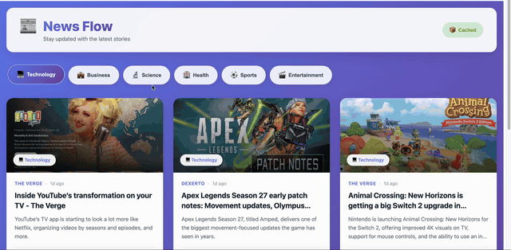

# 🚀 News Flow

Modern news dashboard with **FastAPI**, **Angular**, **Redis**, and **PostgreSQL**.




---

## ✨ Features

- 📰 Real-time news from NewsAPI
- 🚀 Redis caching for performance
- 🎨 Modern gradient UI design
- 📱 Fully responsive
- ⚡ Auto-refresh every 5 minutes
- 🏷️ 6 news categories

---

## 🚀 Quick Start

### Prerequisites
- Docker Desktop
- NewsAPI key from [newsapi.org](https://newsapi.org)

### Setup
```bash
# 1. Clone repository
git clone <repo-url>
cd news-dashboard

# 2. Configure environment
cp .env.example .env
nano .env  # Add your NEWS_API_KEY

# 3. Start services
docker-compose up 

# 4. Access application
# Frontend: http://localhost:4300
# Backend:  http://localhost:9000/docs
```

---

## 🏗️ Architecture
```
Angular (4300) ──→ FastAPI (9000) ──→ NewsAPI
                      ↓
                   Redis Cache
                      ↓
                  PostgreSQL
```

---

## 📁 Project Structure
```
news-dashboard/
├── backend/              # FastAPI
│   ├── app/
│   │   ├── core/        # Config, Redis, Logger
│   │   ├── routers/     # API endpoints
│   │   ├── services/    # Business logic
│   │   └── main.py
│   └── Dockerfile
├── frontend/            # Angular
│   ├── src/app/
│   │   └── features/news/
│   └── Dockerfile
└── docker-compose.yml
```

---

## 🔧 Configuration

Key environment variables in `.env`:
```env
NEWS_API_KEY=your_api_key_here
POSTGRES_PASSWORD=news_password
CACHE_TTL_NEWS=180
BACKEND_PORT=8000
FRONTEND_PORT=4300
```

---

## 📡 API Endpoints
```bash
# Health
GET  /ping
GET  /health

# News
GET  /api/news/?category=technology&page=1&page_size=6
GET  /api/news/categories
POST /api/news/refresh
GET  /api/news/metrics
```

---

## 🐳 Docker Commands
```bash
# Start
docker-compose up -d

# View logs
docker-compose logs -f

# Stop
docker-compose down

# Rebuild
docker-compose build

# Clean up
docker-compose down -v
```


---

## 📊 Available Categories

- 💻 Technology
- 💼 Business
- 🔬 Science
- 🏥 Health
- ⚽ Sports
- 🎬 Entertainment

---

## 📝 License

MIT License - see [LICENSE](LICENSE)

---